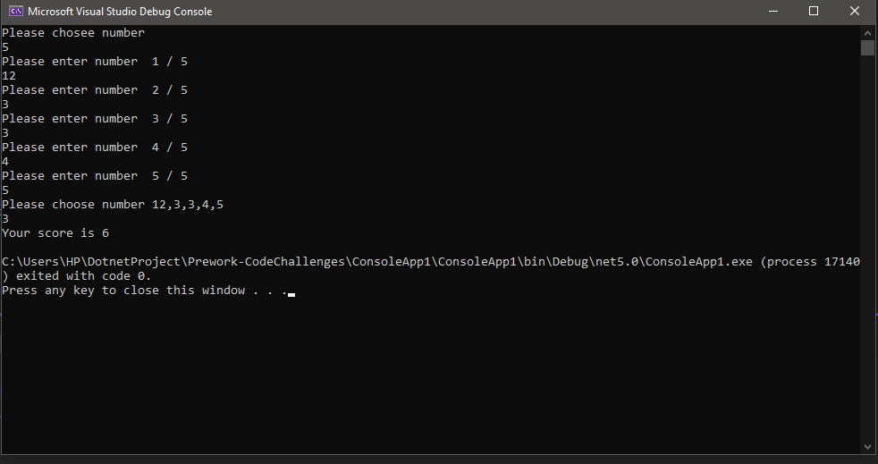

# Prework-CodeChallenges

## Problem 1: Array Max Result

> Create function Selection and Scoring Algorithm , To found frequency of that number in the list Ex :  input : [2,2,3,5,4] => output : if you pick 2 your score will be 4 (2 2) but if you pick 5 your score will be 5 (5 1) .

```C#
 public static int Scoring(int[] arr, int num)
        {
            int count = 0;

            for (int i = 0; i < arr.Length; i++)
            {
                if (arr[i] == num)
                {
                    count++;
                }
            }

            return num * count;
        }
```

## Console Output image 



------