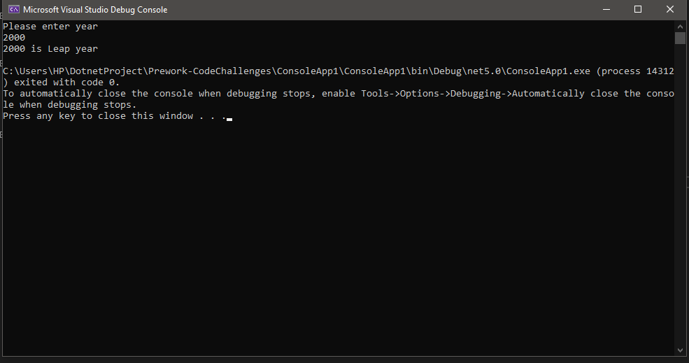
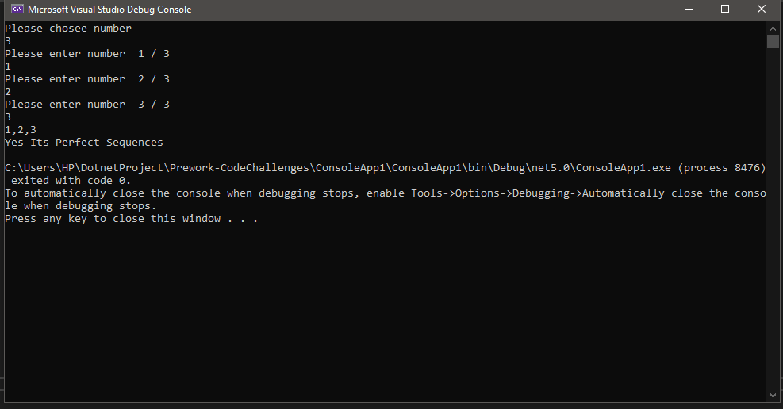
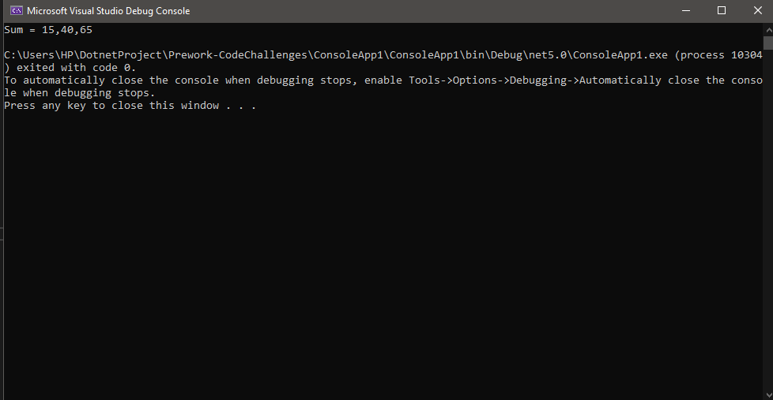

# Prework-CodeChallenges

## Problem 1: Array Max Result

> Create function Selection and Scoring Algorithm , To found frequency of that number in the list Ex :  input : [2,2,3,5,4] => output : if you pick 2 your score will be 4 (2 2) but if you pick 5 your score will be 5 (5 1) .

```C#
 public static int Scoring(int[] arr, int num)
        {
            int count = 0;

            for (int i = 0; i < arr.Length; i++)
            {
                if (arr[i] == num)
                {
                    count++;
                }
            }

            return num * count;
        }
```

## Console Output image 


------

## Problem 2: Leap Year Calculator

> Create function to Calculator Leap Year (A leap year is a year with 366 days that comes every 4 years).

```C#

public static void LeapYear(int year)
        {
            if ((year % 4 == 0 && year % 100 != 0) || year % 400 == 0)
            {
                Console.WriteLine($"{year} is Leap year ");
            }
            else
            {
                Console.WriteLine($"{year} is not Leap year ");
            }
        }

```

## Console Output image 



------

## Problem 3: Perfect Sequence

> Create function to find perfect sequence (perfect sequence is sum of all element and sum must divisible by all element).

```C#

public static string PerfectSequences(int[] arr)
        {
            int sum = 0;
            int check = 0;
            for (int i = 0; i < arr.Length; i++)
            {
                if (arr[i] >= 0)
                {
                    sum += arr[i];
                }
                else
                {
                    return "no";
                }
            }
            if (sum == 0)
            {
                return "yes";
            }
            for (int i = 0; i < arr.Length; i++)
            {
                if(arr[i] == 0){
                    continue;
                }else if (sum % arr[i] == 0)
                {
                    check += 1;
                }
                else
                {
                    return "no";
                }
            }
            return check >= 1 ? "yes" : "no";
        }

```

## Console Output image 




## Problem 4: Sum of Rows

> Create function to find sum of 2D Array . 

```C#

public static int[] SumofRows(int[,] myArray)
        {

            int[] sum = new int[myArray.GetLength(0)];
            int total = 0;
            for (int i = 0; i < myArray.GetLength(0); i++)
            {
                for (int j = 0; j < myArray.GetLength(1); j++)
                {
                    total += myArray[i, j];
                }
                sum[i] = total;
                total = 0;
            }
            return sum;
        }

```

## Console Output image 

